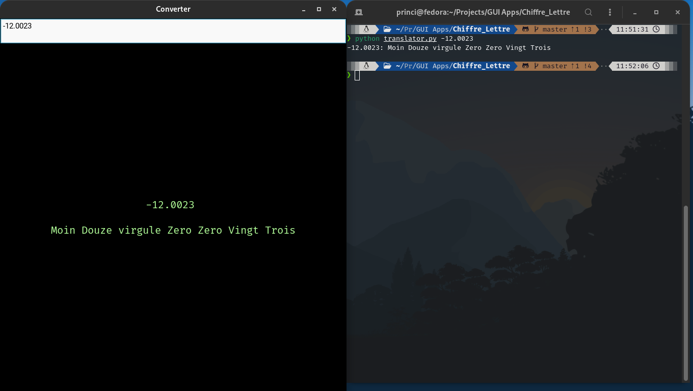

# Chiffre => Lettre

Convertisseur Chiffre -> Lettre



## For GUI

- requirements:
  - python 3
  - kivy

```bash
python main.py -d
```

## For CLI

- requirement:
  - python 3

```bash
python translator.py [chiffre]
```
